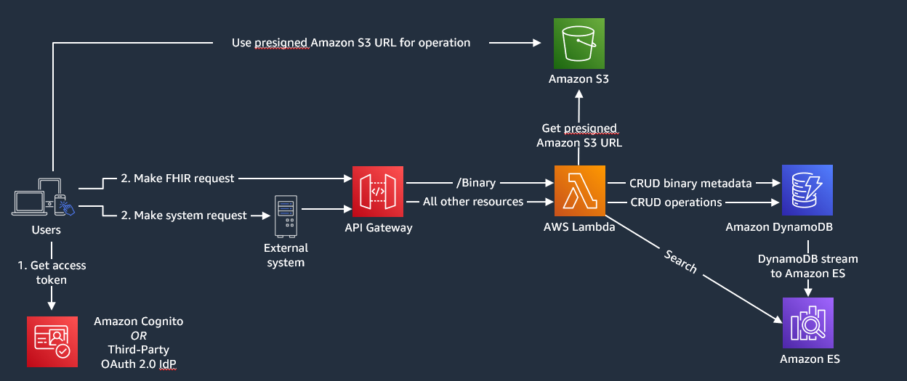
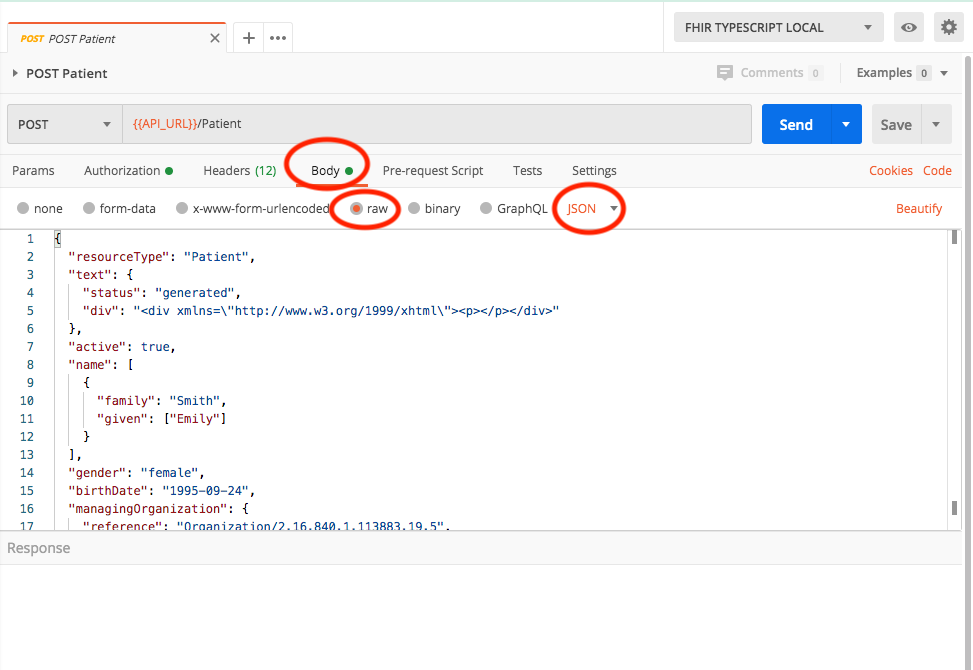

# FHIR Works on AWS deployment

FHIR Works on AWS is a framework that can be used to deploy a [FHIR server](https://www.hl7.org/fhir/overview.html) on AWS. Using this framework, you can customize and add different FHIR functionality to best serve your use cases. When deploying this framework, by default [Cognito and role based access control](https://github.com/awslabs/fhir-works-on-aws-authz-rbac) is used. However, if preferred, you can be authenticated and authorized to access the FHIR server’s resources by using [SMART](https://github.com/awslabs/fhir-works-on-aws-authz-smart) instead of Cognito. Cognito is the default AuthN/AuthZ provider because it is easier to configure than SMART. It doesn’t require setting up a separate IDP server outside of AWS as compared to SMART. However, Cognito authentication is not granular. When a new user is created, it is assigned into the auditor, practitioner, or non-practitioner groups. Depending on the group, the user gets access to different groups of FHIR resources.
The AuthN/Z providers are defined in `package.json` and `config.ts`. You can choose  appropriate providers. SMART allows greater granularity into authentication than Cognito and is the FHIR standard. It allows you to access a FHIR record only if that record has reference to the user.

## FHIR Works on AWS features

FHIR Works on AWS utilizes AWS Lambda, Amazon DynamoDB, Amazon S3 and Amazon Elasticsearch Service to provide the following FHIR features:

+ Create, Read, Update, Delete (CRUD) operations for all R4 or STU3 base FHIR resources
+ Search capabilities per resource type
+ Ability to do versioned reads ([vread](https://www.hl7.org/fhir/http.html#vread))
+ Ability to post a transaction bundle of 25 entries or less. Presently, transaction bundles with only 25 entries or less are supported.

## Accessing FHIR Works on AWS

The easiest and quickest way to access FHIR Works on AWS is by using [AWS solution](https://aws.amazon.com/solutions/implementations/fhir-works-on-aws/). To modify the code and set up a developer environment, follow the steps below:

**Note**: AWS Solution provides an earlier version(See Solutions [CHANGELOG](https://github.com/awslabs/fhir-works-on-aws-deployment/blob/aws-solution/CHANGELOG.md) for more details) of FWoA install. Please follow the instruction below to install from GitHub repository if you wish to install the latest version.

1. Clone or download the repository to a local directory.

Example:

```sh
git clone https://github.com/awslabs/fhir-works-on-aws-deployment.git
```

**Note**: To modify FHIR Works on AWS, create your own fork of the GitHub repository. This allows you to check in any changes you make to your private copy of the code.

2. Use one of the following links to download FHIR Works on AWS:

- [Linux/macOS](./INSTALL.md#linux-or-macos-installation)
- [Windows](./INSTALL.md#windows-installation)
- [Docker](./INSTALL.md#docker-installation)


3. Refer to these [instructions](./DEVELOPMENT.md) for making code changes.

If you intend to use FHIR Implementation Guides read the [Using Implementation Guides](./USING_IMPLEMENTATION_GUIDES.md) documentation first.

If you intend to do a multi-tenant deployment read the [Using Multi-Tenancy](./USING_MULTI_TENANCY.md) documentation first.

If you intend to use FHIR Subscriptions read the [Using Subscriptions](./USING_SUBSCRIPTIONS.md) documentation first.

## Architecture

The system architecture consists of multiple layers of AWS serverless services. The endpoint is hosted using API Gateway. The database and storage layer consists of Amazon DynamoDB and S3, with Elasticsearch as the search index for the data written to DynamoDB. The endpoint is secured by API keys and Cognito for user-level authentication and user-group authorization. The diagram below shows the FHIR server’s system architecture components and how they are related.



## Components overview

FHIR Works on AWS is powered by single-function components. These functions provide you the flexibility to plug your own implementations, if needed. The components used in this deployment are:
+ [Interface](https://github.com/awslabs/fhir-works-on-aws-interface) - Defines communication between the components.
+ [Routing](https://github.com/awslabs/fhir-works-on-aws-routing) - Accepts HTTP FHIR requests, routes it to the other components, logs the errors, transforms output to HTTP responses and generates the [Capability Statement](https://www.hl7.org/fhir/capabilitystatement.html).
+ [Authorization](https://github.com/awslabs/fhir-works-on-aws-authz-rbac) - Accepts the access token found in HTTP header and the action the request is trying to perform. It then determines if that action is permitted.
+ [Persistence](https://github.com/awslabs/fhir-works-on-aws-persistence-ddb) - Contains the business logic for creating, reading, updating, and deleting the FHIR record from the database. FHIR also supports ‘conditional’ CRUD actions and patching.
   + Bundle - Supports multiple incoming requests as one request. Think of someone wanting to create five patients at once instead of five individual function calls. There are two types of bundles, batch and transaction. We currently only support transaction bundles of size 25 entries or fewer, but support batch bundles of up to 750 entries. This 750 limit was drawn from the Lambda payload limit of 6MB and an average request size of 4KB, divided in half to allow for flexibility in request size. This limit can also be configured in the `config.ts`, by specifying the `maxBatchSize` when constructing the `DynamoDBBundleService`.
+ [Search](https://github.com/awslabs/fhir-works-on-aws-search-es) - Enables system-wide searching (/?name=bob) and type searching (/Patient/?name=bob).
+ History - (*Not implemented*) Searches all archived/older versioned resources. This can be done at a system, type or instance level.

## License

This project is licensed under the Apache-2.0 license.

## Setting variables for FHIR on AWS

### Retrieving user variables

After installation, all user-specific variables (such as `USER_POOL_APP_CLIENT_ID`) can be found in the `Info_Output.log` file. You can also retrieve these values by running the following command:
```
serverless info --verbose --region <REGION> --stage <STAGE>.
```
**Note**: The default stage is `dev` and region is `us-west-2`.

If you are receiving `Error: EACCES: permission denied` when running a command, try re-running it using `sudo`.

### Accessing the FHIR API

The FHIR API can be accessed through `API_URL` using the following REST syntax:
```sh
curl -H "Accept: application/json" -H "Authorization: Bearer <COGNITO_AUTH_TOKEN>" -H "x-api-key:<API_KEY>" <API_URL>
```
For more information, click [here](http://hl7.org/fhir/http.html).

### Using Postman to make API requests

To access APIs, you can use Postman as well.  [Postman](https://www.postman.com/) is an API Client for RESTful services that can run on your development desktop for making requests to the FHIR Server. Postman is highly suggested and enables easier access to the FHRI API. You can use Postman to make API requests by following the steps below:

**Importing the collection file**

Under the Postman folder, you can access the JSON definitions for some API requests that you can make against the server. To import these requests into your Postman application, click [here](https://kb.datamotion.com/?ht_kb=postman-instructions-for-exporting-and-importing).

**Note**: Ensure that you import the [Fhir.postman_collection.json](./postman/Fhir.postman_collection.json) collection file.

After you import the collection, set up your environment. You can set up a local environment, a development environment, and a production environment. Each environment should have the correct values configured. For example, the value for `API_URL` for the local environment might be `localhost:3000` while the `API_URL` for the development environment would be your API gateway’s endpoint.

**Setting up environment variables**

Set up the following three Postman environments:

+ `Fhir_Local_Env.json`
+ `Fhir_Dev_Env.json`
+ `Fhir_Prod_Env.json`

For instructions on importing the environment JSON, click [here](https://thinkster.io/tutorials/testing-backend-apis-with-postman/managing-environments-in-postman).

The `COGNITO_AUTH_TOKEN` required for each of these files can be obtained by following the instructions under [Authorizing a user](#authorizing-a-user).

The following variables required in the Postman collection can be found in `Info_Output.log`:
+ API_URL: from Service Information:endpoints: ANY
+ API_KEY: from Service Information: api keys: developer-key

To find what FHIR Server supports, use the `GET Metadata` Postman request to retrieve the [Capability Statement](https://www.hl7.org/fhir/capabilitystatement.html)

**Authorizing a user**

FHIR Works on AWS uses Role-Based Access Control (RBAC) to determine what operations and what resource types a user can access. The default rule set can be found in [RBACRules.ts](https://github.com/awslabs/fhir-works-on-aws-deployment/blob/mainline/src/RBACRules.ts). To access the API, you must use the ID token. This ID token must include scopes of either `openid`, `profile` or `aws.cognito.signin.user.admin`.

Using either of these scopes provide information about users and their group. It helps determine what resources/records they can access.

+ The `openid` scope returns all user attributes in the ID token that are readable by the client. The ID token is not returned if the openid scope is not requested by the client.
+ The `profile` scope grants access to all user attributes that are readable by the client. This scope can only be requested with the openid scope.
+ The `aws.cognito.signin.user.admin` scope grants access to [Amazon Cognito User Pool](https://docs.aws.amazon.com/cognito-user-identity-pools/latest/APIReference/Welcome.html) API operations that require access tokens, such as `UpdateUserAttributes` and `VerifyUserAttribute`.

For more information, click [here](https://docs.aws.amazon.com/cognito/latest/developerguide/cognito-user-pools-app-idp-settings.html).

**Retrieving an ID token using aws.cognito.signin.user.admin**

To access the FHIR API, an ID token is required. A Cognito ID token can be obtained using the following command substituting all variables with their values from `Info_Output.log`.
+	For Windows, enter:
```sh
scripts/init-auth.py <CLIENT_ID> <REGION>
```
+	For Mac, enter:
```sh
python3 scripts/init-auth.py <CLIENT_ID> <REGION>
```
The return value is the `COGNITO_AUTH_TOKEN` (found in the postman collection) to be used for access to the FHIR APIs.

### Accessing binary resources

Binary resources are FHIR resources that consist of binary/unstructured data of any kind. This could be X-rays, PDF, video or other files. This implementation of the FHIR API has a dependency on the API Gateway and Lambda services, which currently have limitations in request/response sizes of 10 MB and 6 MB respectively. The workaround for this limitation is a hybrid approach of storing a binary resource’s metadata in DynamoDB and using S3's get/putPreSignedUrl APIs. So in your requests to the FHIR API, you will store/get the Binary's metadata from DynamoDB and in the response object it will also contain a pre-signed S3 URL, which should be used to interact directly with the binary file.

### Testing binary resources

**Using Postman**

To test, use Postman.  For steps, click [here](https://github.com/awslabs/fhir-works-on-aws-deployment/blob/mainline/README.md#using-postman-to-make-api-requests).

**Note**: We recommend you to test binary resources by using the `Binary` folder in Postman.

**Using cURL**

To test this with cURL, follow these steps:
1.	POST a binary resource to FHIR API using the following command:
```sh
curl -H "Accept: application/json" -H "Authorization: Bearer <COGNITO_AUTH_TOKEN>" -H "x-api-key:<API_KEY>" --request POST \
  --data '{"resourceType": "Binary", "contentType": "image/jpeg"}' \
  <API_URL>/Binary
```
2. Check the POST's response. There will be a presignedPutUrl parameter. Use that pre-signed url to upload your file. See below for command
```sh
curl -v -T "<LOCATION_OF_FILE_TO_UPLOAD>" "<PRESIGNED_PUT_URL>"
```

### Testing bulk data export

Bulk Export allows you to export all of your data from DDB to S3. We currently support the [System Level](https://hl7.org/fhir/uv/bulkdata/export/index.html#endpoint---system-level-export) export. For more information about bulk export, refer to the FHIR [Implementation Guide](https://hl7.org/fhir/uv/bulkdata/export/index.html).

To test this feature on FHIR Works on AWS, make API requests using the [Fhir.postman_collection.json](./postman/Fhir.postman_collection.json) file by following these steps:
1.	In the FHIR Examples collection, under the **Export** folder, use `GET System Export` request to initiate an export request.
2.	In the response, check the Content-Location header field for a URL. The URL should be in the `<base-url>/$export/<jobId>` format.
3.	To get the status of the export job, in the **Export** folder, use the GET System Job Status request. Enter the `jobId` value from step 2 in that request.
4.	Check the response that is returned from `GET System Job Status`. If the job is in progress, the response header will have the field `x-progress: in-progress`. Keep polling that URL every 10 seconds until the job is complete. Once the job is complete, you'll get a JSON body with presigned S3 URLs of your exported data. You can download the exported data using those URLs.
Example:
```sh
{
    "transactionTime": "2021-03-29T16:49:00.819Z",
    "request": "https://xyz.execute-api.us-west-2.amazonaws.com/$export?_outputFormat=ndjson&_since=1800-01-01T00%3A00%3A00.000Z&_type=Patient",
    "requiresAccessToken": false,
    "output":
    [
        {
            "type": "Patient",
            "url": "https://fhir-service-dev-bulkexportresultsbucket-.com/abc"
        }
    ],
    "error": []
}
```
**Note**: To cancel an export job, use the `Cancel Export Job` request in the "Export" folder located in the Postman collections.

## Troubleshooting FHIR Works on AWS

+ If changes are required for the Elasticsearch instances, you may have to redeploy. Redeployment deletes the Elasticsearch cluster and creates a new one. Redeployment also deletes the data inside your cluster. In future releases, we will create a one-off lambda instance that can retrieve the data from DynamoDB to Elasticsearch. To do this, you can currently use either of the following options:
   + You can manually push the DynamoDB data to Elasticsearch by creating a lambda instance.
   + You can refresh your DynamoDB table with a backup.
   + You can remove all data from the DynamoDB table and that will create parity between Elasticsearch and DynamoDB.

+ Support for STU3 and [R4](https://www.hl7.org/fhir/validation.html) releases of FHIR is based on the JSON schema provided by HL7. The schema for R4 is more restrictive than the schema for [STU3](http://hl7.org/fhir/STU3/validation.html). The STU3 schema doesn’t restrict appending additional fields into the POST/PUT requests of a resource, whereas the R4 schema has a strict definition of what is permitted in the request. You can access the schema [here](https://github.com/awslabs/fhir-works-on-aws-routing/blob/mainline/src/router/validation/schemas/fhir.schema.v3.json).

**Note**: We are using the official schema provided by [HL7](https://www.hl7.org/fhir/STU3/downloads.html).

+ When making a `POST`/`PUT` request to the server, if you get an error that includes the text `Failed to parse request body as JSON resource`, check that you've set the request headers correctly. The header for `Content-Type` should be either `application/json` or `application/fhir+json`. If you're using Postman for making requests, in the **Body** tab, make sure to change the setting to `raw` and `JSON`.


## Feedback
We'd love to hear from you! Please reach out to our team via [Github Issues](https://github.com/awslabs/fhir-works-on-aws-deployment/issues) for any feedback.
