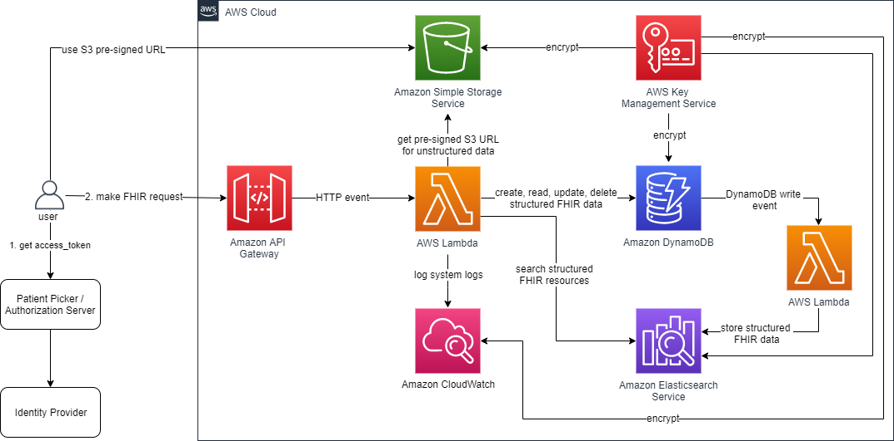
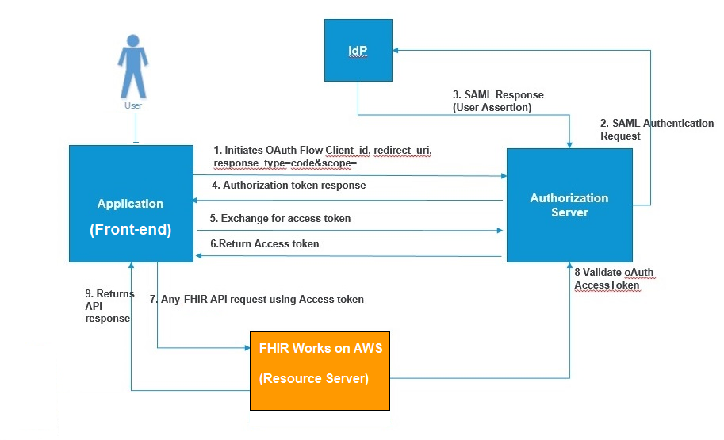

# fhir-works-on-aws-deployment `smart` branch

FHIR Works on AWS is a framework to deploy a [FHIR](https://www.hl7.org/fhir/overview.html) server on AWS. This package is an example implementation of this framework and the [Substitutable Medical Applications, Reusable Technologies (SMART on FHIR) specification](https://docs.smarthealthit.org/). The power of this framework is being able to customize and add in additional FHIR functionality for your unique use-case. An example of this, is this implementation uses [DynamoDB](https://github.com/awslabs/fhir-works-on-aws-persistence-ddb). Say you don't want to use DynamoDB, you could implement your own persistence component and plug it into your deployment package. With FHIR Works on AWS you control how your FHIR server will work!

**NOTE:** to us this SMART implementation it is expected that you already have an OAuth2 SMART compliant authorization server. To learn more please check out [OAuth2 Flow](#oauth2-flow) and [Authorization Prerequisites](#prerequisites)

## Capabilities

This deployment implementation utilizes Lambda, DynamoDB, S3 and Elasticsearch to provide these FHIR capabilities:

- CRUD operations for all R4 or STU3 base FHIR resources
- Search capabilities per resource type
- Ability to do versioned reads (vread)
- Ability to post a transaction bundle of 25 entries or less
- Compliant with SMART on FHIR clinical scopes and authorizes by what the requestor or patient in context is referenced in. For detailed information check out the [authz-smart package](https://github.com/awslabs/fhir-works-on-aws-authz-smart)

## Quick start/installation

Do you want to just try out a FHIR server and don't care about SMART? The easiest and quickest way to experience the non-SMART FHIR server is through [AWS solutions](https://aws.amazon.com/solutions/implementations/fhir-works-on-aws/). If you are interested in the SMART experience please continue reading!

## Architecture

The system architecture consists of multiple layers of AWS serverless services. The endpoint is hosted using API Gateway. The database and storage layer consists of Amazon DynamoDB and S3, with Elasticsearch as the search index for the data written to DynamoDB. The endpoint is secured by API keys, SMART on FHIR OAuth2 for authentication and attribute based access control for authorization. The diagram below shows the FHIR server’s system architecture components and how they are related.


### OAuth2 Flow

The below image shows a step by step OAuth flow and where FHIR Works on AWS fits into the overall picture. As you can tell FHIR Works on AWS is not an authorization server or a SMART front-end app. FHIR Works on AWS should be thought of as just the resource server. If you have questions on how to build a SMART compliant authorization server please check out other implementations like [Okta's](https://github.com/dancinnamon-okta/okta-smartfhir-docs). If you have questions on how to build a SMART compliant front-end application you can check out [growth-chart-app](https://github.com/smart-on-fhir/growth-chart-app). If you still have questions please do not hesitate in opening an issue.



## Components overview

FHIR Works on AWS is powered by many singly functioned components. We built it this way to give customers the flexibility to plug in their own implementations if needed. The components used in this deployment are:

- [Interface](https://github.com/awslabs/fhir-works-on-aws-interface) - Responsible for defining the communication between all the other components
- [Routing](https://github.com/awslabs/fhir-works-on-aws-routing) - Responsible for taking an HTTP FHIR request and routing it to the other component, catching all thrown errors, transforming output to HTTP responses and generating the [Capability Statement](https://www.hl7.org/fhir/capabilitystatement.html)
- [Authorization](https://github.com/awslabs/fhir-works-on-aws-authz-smart) - Responsible for taking the access token found in the HTTP header and the action the request is trying to perform and determine if that is allowed or not
- [Persistence](https://github.com/awslabs/fhir-works-on-aws-persistence-ddb) - Responsible for all CRUD interactions. FHIR also supports ‘conditional’ CRUD actions and patching
  - Bundle - Responsible for supporting many requests coming in as one request. Think of someone wanting to create 5 patients at once instead of 5 individual calls. There are two types of Bundles: batch & transaction
- [Search](https://github.com/awslabs/fhir-works-on-aws-search-es) - Responsible for both system-wide searching (/?name=bob) and type searching (/Patient/?name=bob)
- History - _NOT IMPLEMENTED_ Responsible for searching all archived/older versioned resources. This can be done at a system, type or instance level.

## Installation

### Prerequisites

Prior to installing this stack you must know three things of your authorization server:

1. Issuer Endpoint - this is the endpoint that mints the access_tokens and will also be the issuer declared in the access_token as well.
1. OAuth2 API Endpoint - this is probably similar to your issuer endpoint but is the prefix to all OAuth2 APIs.
1. Patient Picker Endpoint - SMART on FHIR supports [launch contexts](http://www.hl7.org/fhir/smart-app-launch/scopes-and-launch-context/) and that will typically include a patient picker application that will proxy the /token and /authorize requests.

### Download

Clone or download the repository to a local directory. **Note:** if you intend to modify FHIR Works on AWS you may wish to create your own fork of the GitHub repo and work from that. This allows you to check in any changes you make to your private copy of the solution.

Git Clone example:

```sh
git clone https://github.com/awslabs/fhir-works-on-aws-deployment.git
```

### Install

- [Linux/macOS](./INSTALL.md#linux-or-macos-installation)
- [Windows](./INSTALL.md#windows-installation)
- [Docker](./INSTALL.md#docker-installation)

If you intend to use FHIR Implementation Guides read the [Using Implementation Guides](./USING_IMPLEMENTATION_GUIDES.md) documentation first. 

### Post installation

After your installation of FHIR Works on AWS you will need to update your OAuth2 authorization server to set the FHIR Works API Gateway endpoint as the audience of the access token.
### Development

[Instructions for making local code changes](./DEVELOPMENT.md)

## License

This project is licensed under the Apache-2.0 License.

## Usage instructions

### User variables

After installation, all user-specific variables (such as `SERVICE_ENDPOINT`) can be found in the `INFO_OUTPUT.yml` file. You can also retrieve these values by running `serverless info --verbose --region <REGION> --stage <STAGE>`. **NOTE:** default stage is `dev` and region is `us-west-2`.

If you are receiving `Error: EACCES: permission denied` when executing a command, try re-running the command with `sudo`.

### Accessing the FHIR API

The FHIR API can be accessed through the API_URL using REST syntax as defined by FHIR here

> http://hl7.org/fhir/http.html

using this command

```sh
curl -H "Accept: application/json" -H "Authorization:<OAUTH2_TOKEN>" -H "x-api-key:<API_KEY>" <API_URL>
```

Other means of accessing the API are valid as well, such as Postman. More details for using Postman are detailed below in the _Using Postman to make API Requests_ section.

#### Using Postman to make API Requests

[Postman](https://www.postman.com/) is an API Client for RESTful services that can run on your development desktop for making requests to the FHIR Server. Postman is highly suggested and will make accessing the FHRI API much easier.

Included in this code package, under the folder “postman”, are JSON definitions for some requests that you can make against the server. To import these requests into your Postman application, you can follow the directions [here](https://kb.datamotion.com/?ht_kb=postman-instructions-for-exporting-and-importing). Be sure to import the collection file.

> [FHIR_SMART.postman_collection.json](./postman/FHIR_SMART.postman_collection.json)

After you import the collection, you need to set up your environment. You can set up a local environment, or a development environment. Each environment should have the correct values configured for it. For example the _API\_URL_ for the local environment might be _localhost:3000_ while the _API\_URL_ for the development environment would be your API Gateway’s endpoint.

Instructions for importing the environment JSON is located [here](https://thinkster.io/tutorials/testing-backend-apis-with-postman/managing-environments-in-postman). The environment file is [FHIR_SMART.postman_environment.json](./postman/FHIR_SMART.postman_environment.json)

The API_URL & API_KEY variables required in the POSTMAN collection can be found in `Info_Output.yml` or by running `serverless info --verbose`. The remaining variables should be found within your authorization server.

- API_URL: from Service Information:endpoints: ANY
- API_KEY: from Service Information: api keys: developer-key
- OAUTH_URL: this should be your patientPickerEndpoint,
- OAUTH_CLIENT_ID: this is your OAuth client id; found within your authorization server
- OAUTH_CLIENT_SECRET: this is your OAuth client secret; found within your authorization server

To know what all this FHIR API supports please use the `GET Metadata` postman to generate a [Capability Statement](https://www.hl7.org/fhir/capabilitystatement.html).

### Authorizing a user

FHIR Works on AWS assumes the SMART authorization server is set-up outside of this deployment. The assumptions made and requirements of the authorization server can be found in the [authz-smart](https://github.com/awslabs/fhir-works-on-aws-authz-smart) package. At a high-level though the authz-smart package uses the [SMART clinical scopes](http://www.hl7.org/fhir/smart-app-launch/scopes-and-launch-context/#clinical-scope-syntax) and attribute based access control to authorize users. Further customization can be found in the: [authZConfig.ts](src/authZConfig.ts).

### Accessing Binary resources

Binary resources are FHIR resources that consist of binary/unstructured data of any kind. This could be X-rays, PDF, video or other files. This implementation of the FHIR API has a dependency on the API Gateway and Lambda services, which currently have limitations in request/response sizes of 10MB and 6MB respectively. This size limitation forced us to look for a workaround. The workaround is a hybrid approach of storing a Binary resource’s _metadata_ in DynamoDB and using S3's get/putPreSignedUrl APIs. So in your requests to the FHIR API you will store/get the Binary's _metadata_ from DynamoDB and in the response object it will also contain a pre-signed S3 URL, which should be used to interact directly with the Binary file.

### Testing Bulk Data Export

Bulk Export allows you to export all of your data from DDB to S3. We currently only support [System Level](https://hl7.org/fhir/uv/bulkdata/export/index.html#endpoint---system-level-export) export.

The easiest way to test this feature on FHIR Works on AWS is to make API requests using the provided [FHIR_SMART.postman_collection.json](./postman/FHIR_SMART.postman_collection.json).

1. In the collection, under the "Export" folder, use `GET System Export` request to initiate an Export request.
2. In the response, check the header field `Content-Location` for a URL. The url should be in the format `<base-url>/$export/<jobId>`.
3. To get the status of the export job, in the "Export" folder used the `GET System Job Status` request. That request will ask for the `jobId` value from step 2.
4. Check the response that is returned from `GET System Job Status`. If the job is in progress you will see a header with the field `x-progress: in-progress`. Keep polling that URL until the job is complete. Once the job is complete you'll get a JSON body with presigned S3 URLs of your exported data. You can download the exported data using those URLs.

Note: To cancel an export job that is in progress, you can use the `Cancel Export Job` request in the "Export" folder in POSTMAN collections.

#### Postman (recommended)

To test we suggest you to use Postman, please see [here](#using-postman-to-make-api-requests) for steps.

#### cURL

To test this with cURL, use the following command:

1. POST a Binary resource to FHIR API:

```sh
curl -H "Accept: application/json" -H "Authorization:<OAUTH2_TOKEN>" -H "x-api-key:<API_KEY>" --request POST \
  --data '{"resourceType": "Binary", "contentType": "image/jpeg"}' \
  <API_URL>/Binary
```

1. Check the POST's response. There will be a `presignedPutUrl` parameter. Use that pre-signed url to upload your file. See below for command

```sh
curl -v -T "<LOCATION_OF_FILE_TO_UPLOAD>" "<PRESIGNED_PUT_URL>"
```

## Gotchas/Troubleshooting

- If changes are required for the Elasticsearch instances you may have to do a replacement deployment. Meaning that it will blow away your Elasticsearch cluster and build you a new one. The trouble with that is the data inside is also blown away. In future iterations we will create a one-off lambda that can retrieve the data from DynamoDB to Elasticsearch. A couple of options to work through this currently are:

  1. You can manually redrive the DynamoDB data to Elasticsearch by creating a lambda
  1. You can refresh your DynamoDB table with a back-up
  1. You can remove all data from the DynamoDB table and that will create parity between Elasticsearch and DynamoDB

- Support for STU3 and R4 releases of FHIR is based on the JSON schema provided by HL7. The schema for [R4](https://www.hl7.org/fhir/validation.html) is more restrictive than the schema for [STU3](http://hl7.org/fhir/STU3/validation.html). The STU3 schema doesn’t restrict appending additional fields into the POST/PUT requests of a resource, whereas the R4 schema has a strict definition of what is permitted in the request.

- When making a POST/PUT request to the server, if you get an error that includes the text `Failed to parse request body as JSON resource`, check that you've set the request headers correctly. The header for `Content-Type` should be either `application/json` or `application/fhir+json` If you're using Postman for making requests, in the `Body` tab, be sure to also set the setting to `raw` and `JSON`.
  

## Feedback

We'd love to hear from you! Please reach out to our team: [fhir-works-on-aws-dev](mailto:fhir-works-on-aws-dev@amazon.com) for any feedback.
