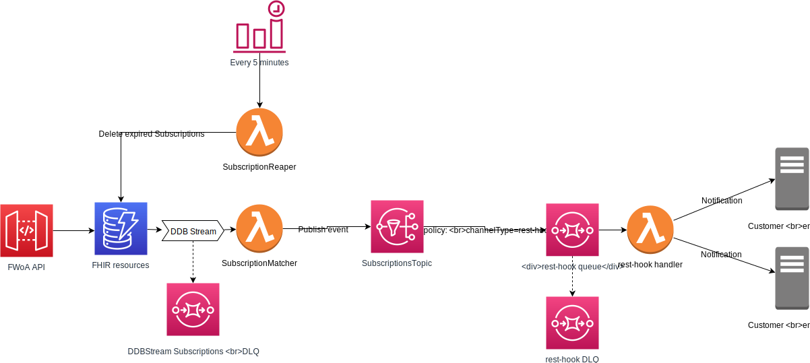

# Subscriptions

The FHIR Subscription resource is used to define a push-based subscription from a server to another system. 
Once a subscription is registered with the server, the server checks every resource that is created or updated, 
and if the resource matches the given criteria, it sends a message on the defined channel so that another system can take an appropriate action.

FHIR Works on AWS implements Subscriptions v4.0.1: https://www.hl7.org/fhir/R4/subscription.html



## Getting Started

1. As an additional security measure, all destination endpoints must be allow-listed before notifications can be delivered to them. 
Update [src/subscriptions/allowList.ts](src/subscriptions/allowList.ts) to configure your allow-list. 


2. Use the `enableSubscriptions` option when deploying the stack:

   ```bash
   yarn deploy -c enableSubscriptions=true
   ```


**Note**  
Enabling subscriptions incurs a cost even if there are no active subscriptions. It is recommended to only enable it if you intend to use it.

## Creating Subscriptions

A Subscription is a FHIR resource. Use the REST API to create, update or delete Subscriptions. 
Refer to the [FHIR documentation](https://www.hl7.org/fhir/R4/subscription.html#resource) for the details of the Subscription resource.

Create Subscription example:
```
POST <API_URL>/Subscription 
{
  "resourceType": "Subscription",
  "status": "requested",
  "end": "2022-01-01T00:00:00Z",
  "reason": "Monitor new neonatal function",
  "criteria": "Observation?code=http://loinc.org|1975-2",
  "channel": {
    "type": "rest-hook",
    "endpoint": "https://my-endpoint.com/on-result",
    "payload": "application/fhir+json"
  }
}
```

After the example Subscription is created, whenever an Observation is created or updated that matches the `criteria`, 
a notification will be sent to `https://my-endpoint.com/on-result`.  

Consider the following when working with Subscriptions:

* Subscriptions start sending notifications within 1 minute of being created.
* Notifications are delivered at-least-once and with best-effort ordering.

## Supported Features

Currently the only supported channel is **REST Hook**.

If a Subscription has an `end` date, it is automatically deleted on that date.

FWoA supports 2 types of notifications

- **Empty notification**

   This kind of notification occurs for Subscriptions without a `channel.payload` defined. Example:
   ```json
   {
     "resourceType": "Subscription",
     "criteria": "Observation?name=http://loinc.org|1975-2",
     "channel": {
       "type": "rest-hook",
       "endpoint": "https://my-endpoint.com/on-result"
     }
   }
   ```
   When a matching Observation is created/updated, FWoA Sends a POST request with an **empty body** to:
   ```
   POST https://my-endpoint.com/on-result
   ```

- **Id-only notification**

   This kind of notification occurs for Subscriptions with `channel.payload` set to `application/fhir+json`. Example:
   ```json
   {
     "resourceType": "Subscription",
     "criteria": "Observation?name=http://loinc.org|1975-2",
     "channel": {
       "type": "rest-hook", 
       "payload": "application/fhir+json",
       "endpoint": "https://my-endpoint.com/on-result"
     }
   }
   ```
   When a matching Observation is created/updated, FWoA Sends a PUT request with an **empty body** to:
   ```
   PUT https://my-endpoint.com/on-result/Observation/<matching ObservationId>
   ```
   **Note**  
   The Id-only notifications differ slightly from the FHIR spec.
   The spec indicates that the entire matching FHIR resource is sent in JSON format, but we chose to only send the Id since
   sending the entire resource poses a security risk.